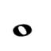

# Custom Image Classifier Using Keras Tuner
Building an image classification model using keras tuner with customize datasets can be efficient and effective appraoch for developing optimized architecture for CNN model.

There are five different music symbols considered for the classification. 
1. Whole Note
2. Half Note
3. Quarter Note
4. Eight Note
5. Sixteenth Note

# Best Model Architecture
Best configuration using tuner
Model: "sequential"
_________________________________________________________________
Layer (type)                 Output Shape              Param #   
=================================================================
conv2d (Conv2D)              (None, 24, 24, 64)        1664      
_________________________________________________________________
conv2d_1 (Conv2D)            (None, 20, 20, 64)        102464    
_________________________________________________________________
conv2d_2 (Conv2D)            (None, 16, 16, 64)        102464    
_________________________________________________________________
flatten (Flatten)            (None, 16384)             0         
_________________________________________________________________
dense (Dense)                (None, 32)                524320    
_________________________________________________________________
dense_1 (Dense)              (None, 5)                 165       
=================================================================
Total params: 731,077
Trainable params: 731,077
Non-trainable params: 0
_________________________________________________________________

# Major Python-Libraries used:
1. tensorflow 2.3.0
2. keras-tuner: 1.0.1
3. matplotlib: 3.2.2
4. pandas: 1.0.5
5. numpy: 1.18.5

# References:

https://keras-team.github.io/keras-tuner/

https://blog.tensorflow.org/2020/01/hyperparameter-tuning-with-keras-tuner.html
